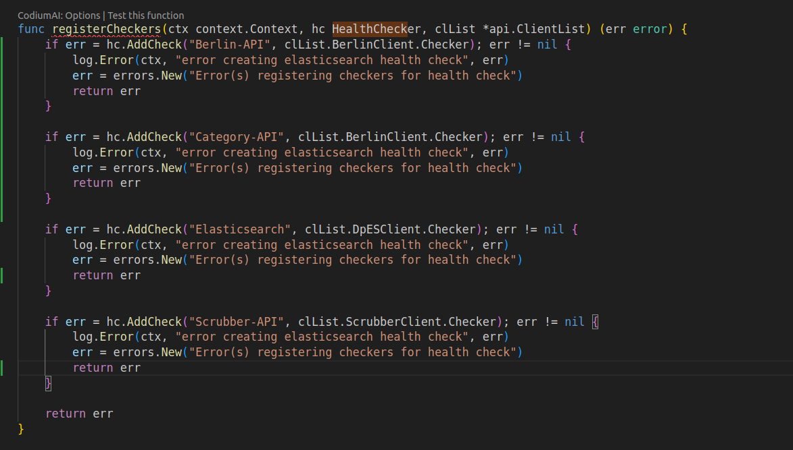
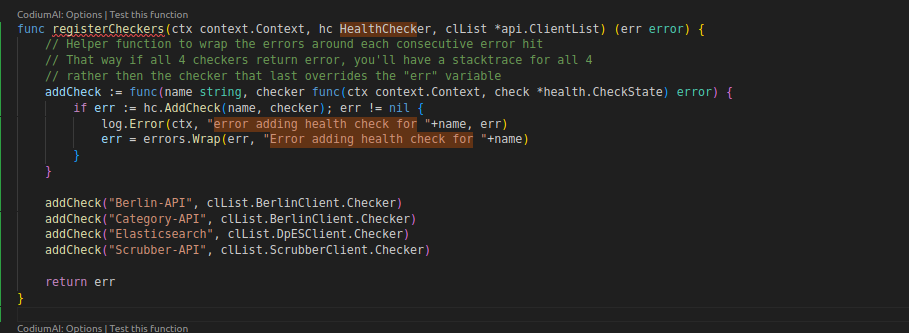
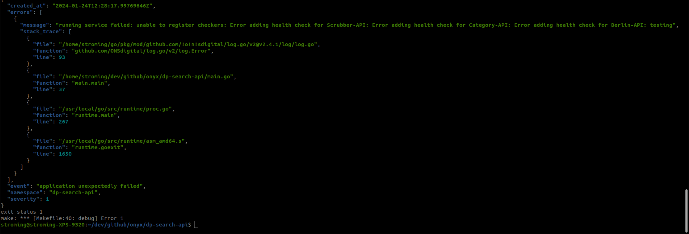
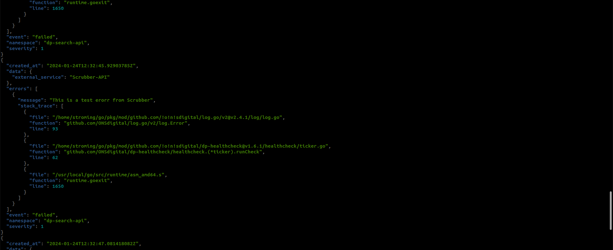
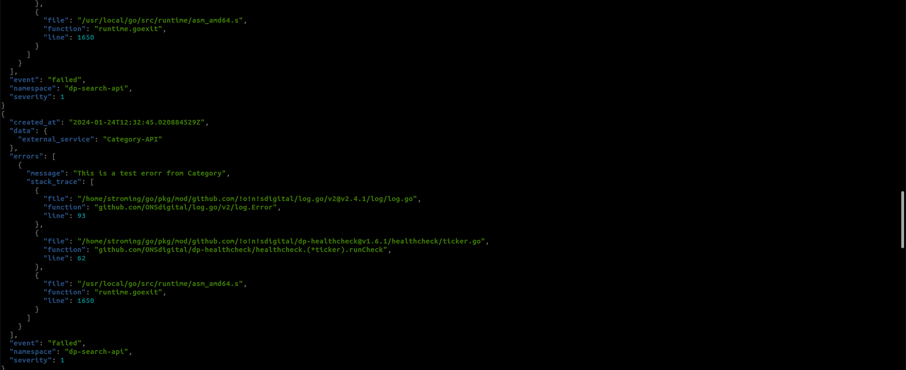

# handling multiple client errors:

Current way: If there's issues with adding checkers to hc then it'll only return the first thing that Errors.
This will not effect any errors that are returned from the checkers themselves only hc.AddCheckers() err.
Meaning all checkers errors will be displayed regardless of approach.

I want to wrap each subsequent error using the helper function below

 

the idea is to get all errors at once instead of fixing one error and waiting for the next

this is how it would look like 

if the AddCheck - which stops the whole service - returns an error:

if the Checkers return errors - which doesn't exit the service :

