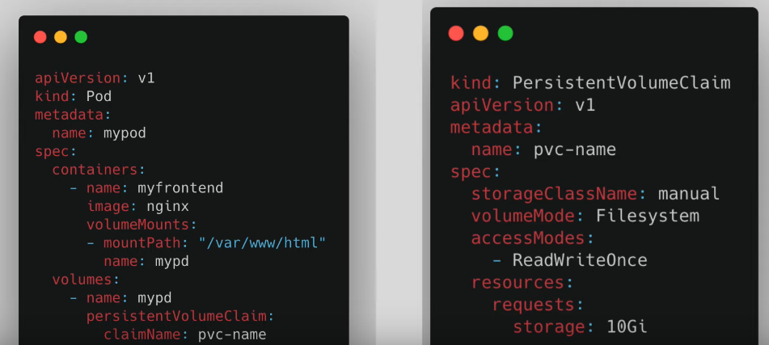

# Persistent Volume Claim

## Description

Request for storage by a Pod. It acts as a request for a specific amount and type of storage (like a specific size and access mode). PVCs are used by developers and application creators to request storage resources without needing to know where or how those resources are physically provisioned. When a PVC is created, the Kubernetes control plane tries to find an available PV that matches the claim's requirements and binds them together, allowing the Pod to use the requested storage.

You need to use that persistent volume claim in the pod configuration.

## Levels of abstraction

1. Pods access storage by using the claim as a request to the volume. 
2. Claims must exist in the same namespace as the pod.
1. Volume is then mounted into the pod.
1. Volume is then mounted into the container
